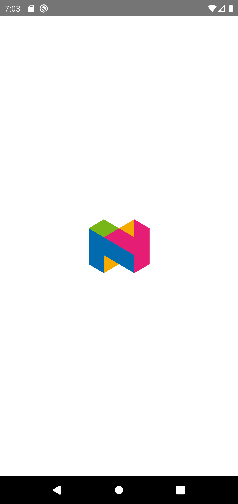
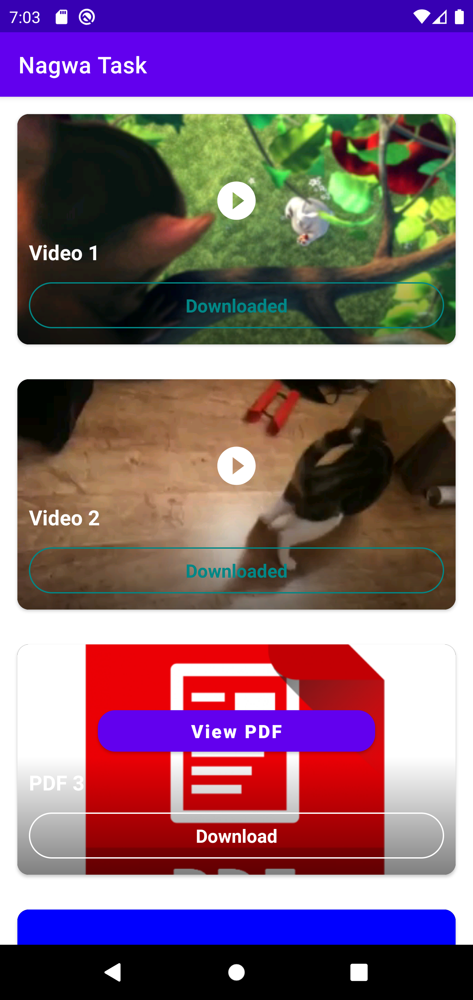
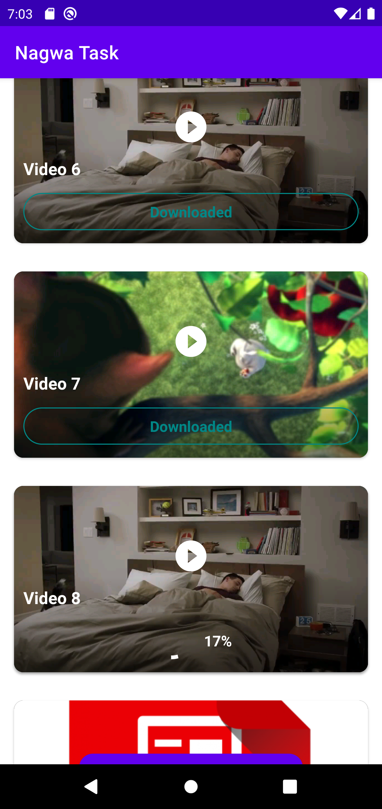

 # Nagwa Task
 
 simple mobile application that get fake responses for the list of videos and books and you can choose one file to download , and
 showing download percentage progress for the item if the item is downloading ,and mark the item that was downloaded and the item being downloaded .
 
 Implemented by the dependencies/libraries:
 * Rxjava
 * Kotlin
 * Dagger2
 * MVP architecture. 
 * PDFViewer (for PDF)
 * Exoplayer (for playing videos)
 * PRDownloader (for downlaod and save video andd pdf)

# Screenshots

   .  
